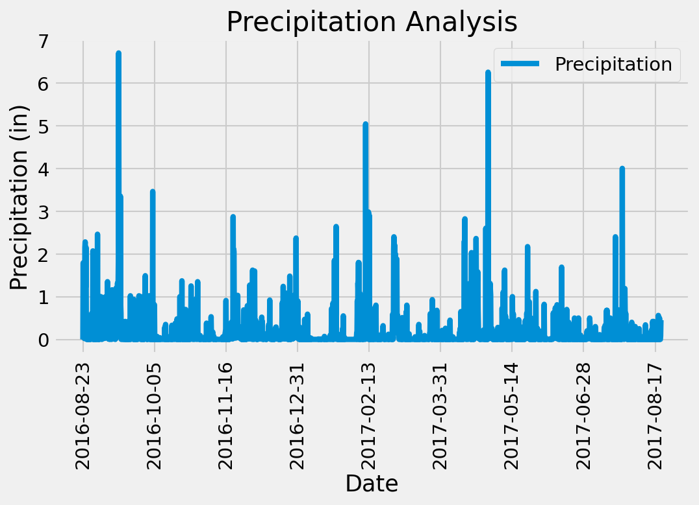
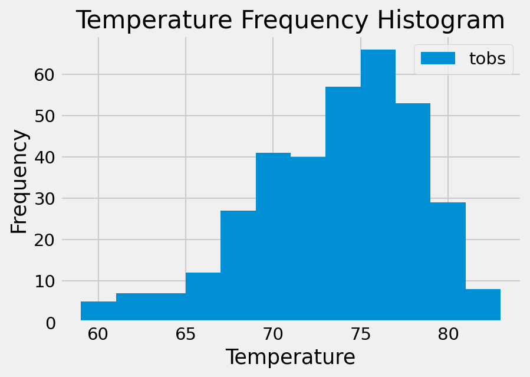
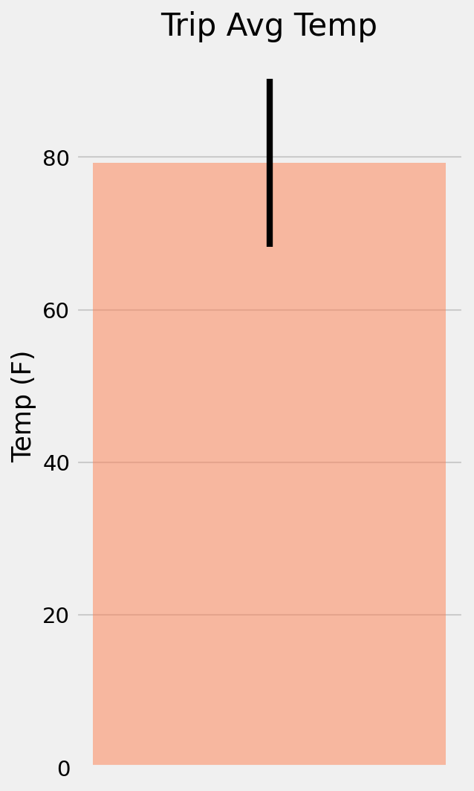
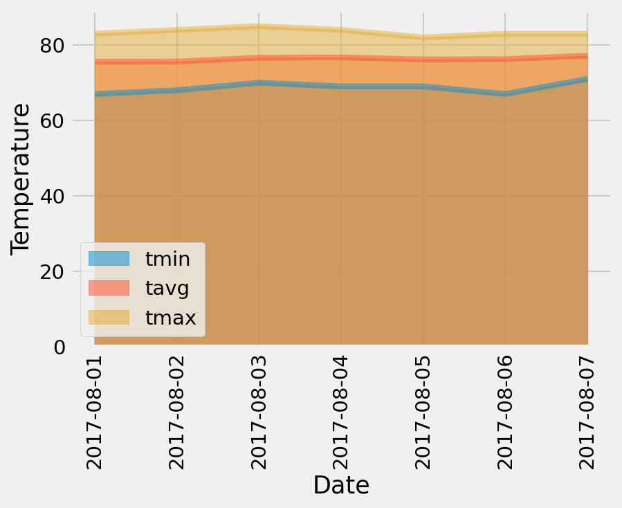

# SQLAlchemy Homework - Surfs Up!

Congratulations! I treated myself to a long holiday vacation in Honolulu, Hawaii! To help with my trip planning, I needed to do some climate analysis on the area. The following outlines what I did. Check out my [climate_starter Jupyter Notebook here](https://github.com/Kpearson72/sqlalchemy-challenge/blob/main/climate_starter.ipynb)

## Step 1 - Climate Analysis and Exploration

To begin, I used Python and SQLAlchemy to do basic climate analysis and data exploration of my climate database. All of the following analysis should be completed using SQLAlchemy ORM queries, Pandas, and Matplotlib.

### Precipitation Analysis

* I started by finding the most recent date in the data set.

* Using this date, I retrieved the last 12 months of precipitation data by querying the 12 preceding months of data. 

  

### Station Analysis

* Design a query to calculate the total number of stations in the dataset.

* Design a query to find the most active stations (i.e. which stations have the most rows?).

  * List the stations and observation counts in descending order.

  * Which station id has the highest number of observations?

  * Using the most active station id, calculate the lowest, highest, and average temperature.

* Design a query to retrieve the last 12 months of temperature observation data (TOBS).

  * Filter by the station with the highest number of observations.

  * Query the last 12 months of temperature observation data for this station.

  * Plot the results as a histogram with `bins=12`.

    

- - -

## Step 2 - Climate App

Now that I've completed my initial analysis, I designed a [Flask API](https://github.com/Kpearson72/sqlalchemy-challenge/blob/main/app.py) based on the queries that I've just developed.

Here is my process:
* Use Flask to create routes.

### Routes

* `/`

  * Home page.

  * List all routes that are available.

* `/api/v1.0/precipitation`

  * Convert the query results to a dictionary using `date` as the key and `prcp` as the value.

  * Return the JSON representation of the dictionary.

* `/api/v1.0/stations`

  * Return a JSON list of stations from the dataset.

* `/api/v1.0/tobs`
  * Query the dates and temperature observations of the most active station for the last year of data.

  * Return a JSON list of temperature observations (TOBS) for the previous year.

* `/api/v1.0/<start>` and `/api/v1.0/<start>/<end>`

  * Return a JSON list of the minimum temperature, the average temperature, and the max temperature for a given start or start-end range.

  * When given the start only, calculate `TMIN`, `TAVG`, and `TMAX` for all dates greater than and equal to the start date.

  * When given the start and the end date, calculate the `TMIN`, `TAVG`, and `TMAX` for dates between the start and end date inclusive.

## Bonus: Other Recommended Analyses

### [Temperature Analysis I](https://github.com/Kpearson72/sqlalchemy-challenge/blob/main/temp_analysis_bonus_1_starter.ipynb)

* Hawaii is reputed to enjoy mild weather all year. Is there a meaningful difference between the temperature in, for example, June and December?

* Use pandas to perform this portion.

  * Convert the date column format from string to datetime.

  * Set the date column as the DataFrame index

  * Drop the date column

* Identify the average temperature in June at all stations across all available years in the dataset. Do the same for December temperature.

* Use the t-test to determine whether the difference in the means, if any, is statistically significant. Will I use a paired t-test, or an unpaired t-test? Why?

### [Temperature Analysis II](https://github.com/Kpearson72/sqlalchemy-challenge/blob/main/temp_analysis_bonus_2_starter.ipynb)

* I am looking to take a trip from August first to August seventh of this year, but are worried that the weather will be less than ideal. Using historical data in the dataset find out what the temperature has previously looked like.

* The starter notebook contains a function called `calc_temps` that will accept a start date and end date in the format `%Y-%m-%d`. The function will return the minimum, average, and maximum temperatures for that range of dates.

* Use the `calc_temps` function to calculate the min, avg, and max temperatures for my trip using the matching dates from a previous year (i.e., use "2017-08-01").

* Plot the min, avg, and max temperature from my previous query as a bar chart.

  * Use "Trip Avg Temp" as the title.

  * Use the average temperature as the bar height (y value).

  * Use the peak-to-peak (TMAX-TMIN) value as the y error bar (YERR).

    

### Daily Rainfall Average

* Now that I have an idea of the temperature lets check to see what the rainfall has been, I don't want a when it rains the whole time!

* Calculate the rainfall per weather station using the previous year's matching dates.

  * Sort this in descending order by precipitation amount and list the station, name, latitude, longitude, and elevation.

* Calculate the daily normals. Normals are the averages for the min, avg, and max temperatures. I was provided with a function called `daily_normals` that will calculate the daily normals for a specific date. This date string will be in the format `%m-%d`. Be sure to use all historic TOBS that match that date string.

  * Set the start and end date of the trip.

  * Use the date to create a range of dates.

  * Strip off the year and save a list of strings in the format `%m-%d`.

  * Use the `daily_normals` function to calculate the normals for each date string and append the results to a list called `normals`.

* Load the list of daily normals into a Pandas DataFrame and set the index equal to the date.

* Use Pandas to plot an area plot (`stacked=False`) for the daily normals.

  

